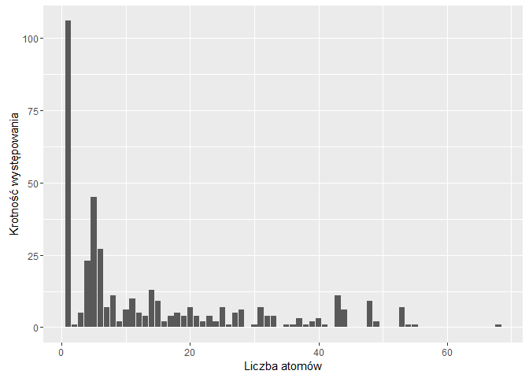
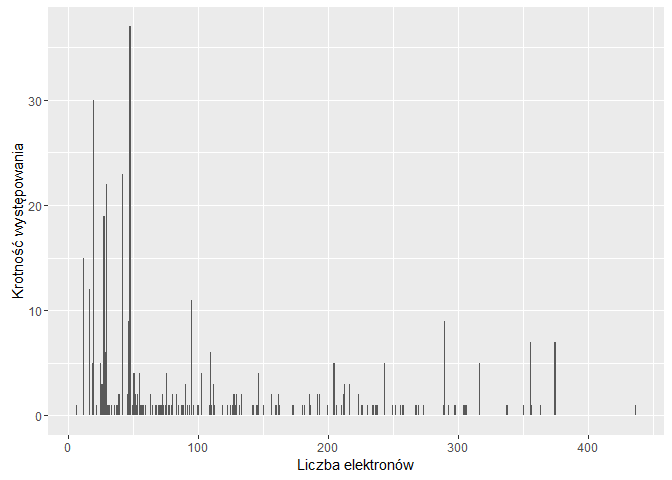

# Raport_ZED
Jedrzej Karpiewski  
11 stycznia 2016  

Na początku pliku powinna znajdować się automatycznie wypełniona data generacji dokumentu oraz spis treści pozwalający przejść do najważniejszych sekcji. Ponadto raport powinien zaczynać się od rozdziału podsumowującego całą analizę, streszczającego najważniejsze zauważone rzeczy. Po wstępie, raport powinien zawierać następujące elementy:

1. Kod wyliczający wykorzystane biblioteki;

```r
search()
```

```
##  [1] ".GlobalEnv"        "package:ggplot2"   "package:dplyr"    
##  [4] "package:stats"     "package:graphics"  "package:grDevices"
##  [7] "package:utils"     "package:datasets"  "package:methods"  
## [10] "Autoloads"         "package:base"
```
2.Kod zapewniający powtarzalność wyników przy każdym uruchomieniu raportu na tych samych danych;

-cache???

3.Kod pozwalający wczytać dane z pliku;

```r
data <- read.csv(file="1000.txt",head=TRUE,sep=";")
```
4. Kod usuwający z danych wiersze posiadające wartość zmiennej res_name równą: “DA”,“DC”,“DT”, “DU”, “DG”, “DI”,“UNK”, “UNX”, “UNL”, “PR”, “PD”, “Y1”, “EU”, “N”, “15P”, “UQ”, “PX4” lub “NAN”;

```r
data <- filter(data, res_name != "DA", res_name != "DC",res_name != "DT", res_name != "DU", res_name != "DG", res_name != "DI",res_name != "UNK", res_name != "UNX", res_name != "UNL", res_name != "PR", res_name != "PD", res_name != "Y1", res_name != "EU", res_name != "N", res_name != "15P", res_name != "UQ", res_name != "PX4",res_name != "NAN")
```
5.Kod pozostawiający tylko unikatowe pary wartości (pdb_code, res_name)

```r
clean_data <- distinct(data, pdb_code, res_name)
#head(clean_data, 10)
```
6.Krótkie podsumowanie wartości w każdej kolumnie;

```r
# knitr::kable(summary(data))
# summary(data)
```

7.Sekcje sprawdzającą korelacje między zmiennymi; sekcja ta powinna zawierać jakąś formę graficznej prezentacji korelacji;

```r
#wykonać funkcję cor() na wszystkich parach kolumn "zielonych"
#pocisnac te kolumny foreachem?
```

8.Określenie ile przykładów ma każda z klas (res_name);

```r
count_data <- count(clean_data, res_name)
arrange(count_data, desc(n))
```

```
## Source: local data frame [169 x 2]
## 
##    res_name     n
##      (fctr) (int)
## 1       SO4    33
## 2        CA    27
## 3       GOL    23
## 4        ZN    22
## 5        MG    15
## 6        CL    12
## 7       NAG    12
## 8       EDO    10
## 9       PO4     9
## 10      HEM     8
## ..      ...   ...
```

9.Wykresy rozkładów liczby atomów (local_res_atom_non_h_count) i elektronów (local_res_atom_non_h_electron_sum);

```r
atoms_data <- count(clean_data, local_res_atom_non_h_count)
#atoms_data
ggplot(atoms_data, 
  mapping=aes(
      x=local_res_atom_non_h_count, 
      y=n) 
) + geom_bar(stat="identity") + xlab("Liczba atomów") + ylab("Krotność występowania") 
```

\

```r
  #+
  #scale_x_continuous(breaks = seq(0, 30, 1)) +
  #scale_y_continuous(breaks = seq(0, 30, 1))

electrons_data <- count(clean_data, local_res_atom_non_h_electron_sum)
#electrons_data
ggplot(electrons_data, 
  mapping=aes(
      x=local_res_atom_non_h_electron_sum, 
      y=n) 
) + geom_bar(stat="identity") + xlab("Liczba elektronów") + ylab("Krotność występowania") 
```

\

```r
  #+
  #scale_x_continuous(breaks = seq(0, 30, 1)) +
  #scale_y_continuous(breaks = seq(0, 30, 1))
```

10.Próbę odtworzenia następującego wykresu (oś X - liczba elektronów, oś y - liczba atomów): 


11.Tabelę pokazującą 10 klas z największą niezgodnością liczby atomów (local_res_atom_non_h_count vs dict_atom_non_h_count) i tabelę pokazującą 10 klas z największą niezgodnością liczby elektronów (local_res_atom_non_h_electron_sum vs dict_atom_non_h_electron_sum;)


```r
diff_between_expected_atoms <- select(clean_data, res_name, local_res_atom_non_h_count, dict_atom_non_h_count) %>%
mutate(diff = abs(local_res_atom_non_h_count - dict_atom_non_h_count), diff_squared = diff*diff) %>%
group_by(res_name) %>% 
  summarize(difference_mean = mean(diff), standard_deviation = sqrt(mean(diff_squared))) %>%
  arrange(desc(standard_deviation),desc(difference_mean))

knitr::kable(head(diff_between_expected_atoms,10), col.names = c("Nazwa ligandu","Średnia różnica od wartości oczekiwanej","Odchylenie standardowe"), caption = "Tabela przedstawiająca 10 klas z największą niezgodnością liczby atomów (sort po odchyleniu standardowym).")
```


Table: Tabela przedstawiająca 10 klas z największą niezgodnością liczby atomów (sort po odchyleniu standardowym).

Nazwa ligandu    Średnia różnica od wartości oczekiwanej   Odchylenie standardowe
--------------  ----------------------------------------  -----------------------
UTP                                            16.000000                16.000000
CPS                                             6.000000                 6.000000
EPE                                             3.333333                 5.773503
NDP                                             1.600000                 3.577709
ATP                                             0.800000                 1.788854
AAL                                             1.000000                 1.000000
ABA                                             1.000000                 1.000000
BGC                                             1.000000                 1.000000
BRU                                             1.000000                 1.000000
BSA                                             1.000000                 1.000000


```r
diff_between_expected_electrons <- select(clean_data, res_name, local_res_atom_non_h_electron_sum, dict_atom_non_h_electron_sum) %>%
mutate(diff = abs(local_res_atom_non_h_electron_sum - dict_atom_non_h_electron_sum), diff_squared = diff*diff) %>%
group_by(res_name) %>% 
  summarize(difference_mean = mean(diff), standard_deviation = sqrt(mean(diff_squared))) %>%
  arrange(desc(standard_deviation),desc(difference_mean))

knitr::kable(head(diff_between_expected_electrons,10), col.names = c("Nazwa ligandu","Średnia różnica od wartości oczekiwanej","Odchylenie standardowe"), caption = "Tabela przedstawiająca 10 klas z największą niezgodnością liczby elektronów (sort po odchyleniu standardowym).")
```


Table: Tabela przedstawiająca 10 klas z największą niezgodnością liczby elektronów (sort po odchyleniu standardowym).

Nazwa ligandu    Średnia różnica od wartości oczekiwanej   Odchylenie standardowe
--------------  ----------------------------------------  -----------------------
UTP                                            108.00000                108.00000
CPS                                             52.00000                 52.00000
EPE                                             21.33333                 36.95042
NDP                                             10.20000                 22.80789
ATP                                              7.80000                 17.44133
CPT                                             17.00000                 17.00000
AAL                                              8.00000                  8.00000
ABA                                              8.00000                  8.00000
BGC                                              8.00000                  8.00000
BRU                                              8.00000                  8.00000

12.Sekcję pokazującą rozkład wartości wszystkich kolumn zaczynających się od part_01 z zaznaczeniem (graficznym i liczbowym) średniej wartości;

13.Sekcję sprawdzającą czy na podstawie wartości innych kolumn można przewidzieć liczbę elektronów i atomów oraz z jaką dokładnością można dokonać takiej predykcji; trafność regresji powinna zostać oszacowana na podstawie miar R^2 i RMSE;

14.Sekcję próbującą stworzyć klasyfikator przewidujący wartość atrybutu res_name (w tej sekcji należy wykorzystać wiedzę z pozostałych punktów oraz wykonać dodatkowe czynności, które mogą poprawić trafność klasyfikacji); klasyfikator powinien być wybrany w ramach optymalizacji parametrów na zbiorze walidującym; przewidywany błąd na danych z reszty populacji powinien zostać oszacowany na danych inne niż uczące za pomocą mechanizmu (stratyfikowanej!) oceny krzyżowej lub (stratyfikowanego!) zbioru testowego.
